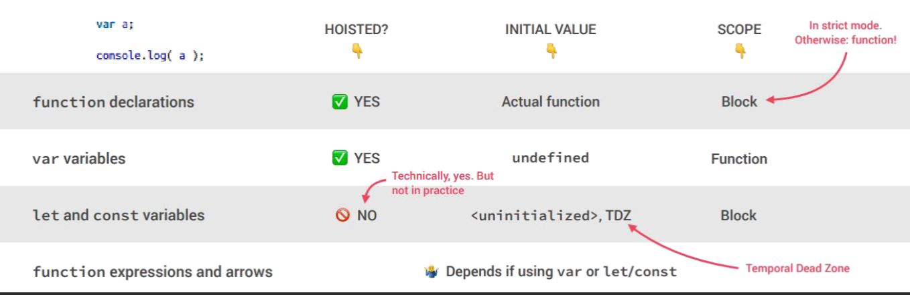

# Lecture 2

Content

- Scope
- Hoisting

# Область видимости или Scope

Область видимости (scope) определяет видимость или доступность переменной (другого ресурса) в области твоего кода.

# Types of Scope (Область видимости):

# Глобальная область видимости или Global Scope

    В JavaScript есть только одна глобальная область. Область за пределами всех функций считается глобальной областью, и переменные, определенные в глобальной области, могут быть доступны и изменены в любых других областях.

    // Глобальная область

        var num = 5;
        console.log(num);   // 5

        function getNum(){
          console.log(num); // num доступен здесь
        }

        getNum();           // 5

# Локальная область видимости или Local Scope

    Переменные, объявленные внутри функций, становятся локальными для функции и рассматриваются в соответствующей локальной области. Каждая функция имеет свою область видимости. Одна и та же переменная может использоваться в разных функциях, поскольку они связаны с соответствующими функциями и не являются взаимно видимыми.

    // Глобальная область

    function foo1(){
        // Локальная область 1
      function foo2(){
        // Локальная область 2
      }
    }

    // Глобальная область
    function foo3(){
      // Локальная область 3
    }

    // Глобальная область

- Область видимости функции

  Всякий раз, когда мы объявляем переменную в функции, переменная видна только внутри функции. Мы не можем получить к ней доступ вне функции. var - это ключевое слово, определяющее переменную для доступности области функций.

        function foo(){
            var num = 10;
            console.log('inside function: ', num);
        }

  foo(); // inside function: 10

  console.log(num); // ReferenceError: num is not defined

# Область видимости блока

    Область видимости блока - это область в условиях if и switch или циклов for, и while. Вообще говоря, всякий раз, когда мы видим фигурные скобки {} - это блок. В ES6 ключевые слова const и let позволяют разработчикам объявлять переменные в области видимости блока, что означает, что эти переменные существуют только в соответствующем блоке.

    function foo(){
        if (true) {
          var num1 = 5;        // существуют в области видимости функции
          const num2 = 10;     // существуют в области видимости блока
          let num3 = 23;       // существуют в области видимости блока
        }
        console.log(num1);
        console.log(num2);
        console.log(num3);
    }

foo();

// 5

// ReferenceError: num2 is not defined

// ReferenceError: num3 is not defined

# Hoisting

- What is Hoisting ?

        Hoisting is a JavaScript mechanism where variables and function
        declarations are moved to the top of their scope before code
        execution.

- What is Temporal Dead Zone ?

        A variable declared with let or const cannot be accessed until it is declared within its scope.

Additional material:

# Recurrion

- What is Recurrion?

        Recursion is when a function calls itself until someone stops it. If no one stops it then it'll
        recurse (call itself) forever.

        function recurse() {
        // function code
        recurse();
        // function code
        }
        recurse();

  A recursive function must have a condition to stop calling itself. Otherwise, the function is called indefinitely.

  Once the condition is met, the function stops calling itself. This is called a base condition.

  To prevent infinite recursion, you can use if...else statement (or similar approach) where one branch makes the recursive call, and the other doesn't.

# Closure

- What is Closure?

        A closure is the combination of a function bundled together which gives you
        access to an outer function's scope from an inner function

      function greet(name) {
        function displayName() {
         console.log('Hi' + ' ' + name);
      }

      // returning a function
      return displayName;
      }

      const g1 = greet('John');
      console.log(g1); // returns the function definition
      g1(); // calling the function

# lecture2-new
